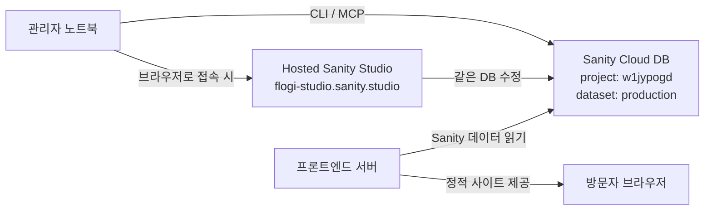

# Flogi's Blog

> Reference-inspired AI/media blog prototype built with Astro and Sanity.

Flogi's Blog는 스터디, 회의, 작업 기록을 정리하는 **Astro + Sanity 프로토타입**입니다.

## Features
- 홈, 스터디, 회의, 작업 목록/상세 페이지
- 모달형 검색 UX
- RSS, sitemap
- Sanity 스키마 초안
- Sanity 미연결 시 fallback 샘플 데이터 지원

## Stack
- Astro 7
- Tailwind CSS 4
- Sanity 6
- Marked (Markdown rendering)
- `@astrojs/sitemap`, `@astrojs/rss`
- Self-hosted static hosting or any server that can serve `dist/`

## Run locally
```bash
npm install
npm run dev
```

## Run Sanity Studio
```bash
cp .env.example .env
npm run studio
```

Hosted Studio:
- `https://flogi-studio.sanity.studio/`

현재 Sanity 프로젝트 기본값:
- `SANITY_PROJECT_ID=w1jypogd`
- `SANITY_DATASET=production`
- `SANITY_API_VERSION=2025-08-22`

필수 환경 변수는 `.env.example`를 참고하세요.

## Sanity MCP
- 이 프로젝트는 공식 hosted Sanity MCP `https://mcp.sanity.io` 사용을 기준으로 합니다.
- Pi에서 사용할 때는 `SANITY_API_TOKEN` 환경변수를 주입한 세션에서 bearer auth로 연결하세요.
- seed import는 MCP가 아니라 `docs/sanity-import.md`의 Sanity CLI 절차를 사용하세요.

## Build
```bash
npm run build
```

## Main routes
- `/`
- `/study`
- `/study/[slug]`
- `/meetings`
- `/meetings/[slug]`
- `/work`
- `/work/[slug]`
- `/search`
- `/tags`
- `/tags/[slug]`
- `/people`
- `/people/[slug]`
- `/rss.xml`

## Project structure
```txt
src/
  components/
    cards/
    content/
    layout/
  layouts/
  lib/
    cms/
    fallback/
    renderers/
    repositories/
    services/
    types/
    utils/
  pages/
    study/
    meetings/
    work/
```

## Sharing and operations
- Flogi 콘텐츠 운영은 **관리자 3명**이 담당합니다.
- 기본 포스팅 작업은 각자 **CLI**로 진행합니다.
- 화면을 보며 직접 수정해야 할 때만 Hosted Studio(`https://flogi-studio.sanity.studio/`)를 사용합니다.
- MCP/CLI 사용자는 각자 자신의 `SANITY_API_TOKEN`을 환경변수로 주입해 공식 Sanity MCP와 Sanity CLI를 사용합니다.

## Sanity operating model


- 작업의 출발점은 **관리자 노트북 1대**라고 보면 됩니다.
- 기본 작업은 **CLI / MCP / Pi**로 진행합니다.
- 직접 화면을 보며 수정할 때만 브라우저에서 **Hosted Sanity Studio**를 엽니다.
- CLI와 Studio는 모두 같은 **Sanity Cloud DB (`w1jypogd / production`)** 를 수정합니다.
- **프론트엔드 서버**는 그 DB를 읽어 정적 사이트를 만들고 방문자에게 제공합니다.

### Document ID convention
```text
siteSettings
person-<slug>
study-<slug>
meeting-<slug>
work-<slug>
```

## Admin setup shortcuts
### 1) Sanity API token 발급
- 프로젝트 API 관리 바로가기: `https://www.sanity.io/manage/project/w1jypogd/api`
- 위 페이지에서 각 관리자 계정으로 **개인용 token**을 발급하세요.
- 토큰은 GitHub, 채팅, `.env`에 평문으로 공유하지 마세요.

### 2) CLI 기본 확인
```bash
cd /Users/hskim/Projects/aifrontier-media
npx sanity debug
npx sanity documents query '*[_type == "study"]{_id,title,slug}'
```

### 3) Pi + 공식 MCP 실행 예시
프로젝트 루트 `.mcp.json`은 이미 공식 hosted MCP를 사용하도록 설정되어 있습니다.

Bitwarden 주입 세션에서 Pi 실행:
```bash
export BWS_ACCESS_TOKEN="$(security find-generic-password -w -s bitwarden-bws-access-token)"
bws run -- pi
```

### 4) Pi에 바로 붙여넣는 프롬프트 예시
현재 스터디 문서 확인:
```text
Use the official Sanity MCP tools only. Connect to project w1jypogd dataset production and list all study documents with _id, title, slug, and published status.
```

새 문서 작성 전 스키마 확인:
```text
Use the official Sanity MCP tools only. Inspect the schema for study, meeting, and work in project w1jypogd / production and summarize the required fields before creating any document.
```

특정 문서 수정:
```text
Use the official Sanity MCP tools only. In project w1jypogd dataset production, load document study-<slug>, show me its current fields, then prepare the exact patch needed to update title, slug, publishedAt, tags, and body.
```

## Notes
- 이 저장소는 프로토타입이지만, 데이터 정규화/empty state/SEO fallback/strict content mode까지 포함해 운영 연결 전 마감 작업을 진행한 상태입니다.
- 콘텐츠 fallback 목업 데이터는 제거되어, Sanity가 비어 있으면 목록/상세 대신 빈 상태 UI가 보입니다.
- 운영 배포에서는 `SANITY_STRICT_CONTENT=true` 설정을 권장합니다.
- 글 작성/수정은 프론트 서비스 내부가 아니라 `Sanity Studio`에서 수행합니다.
- 수정 권한은 앱 내부 권한 시스템이 아니라 `Sanity 프로젝트 멤버 권한`으로 관리합니다.
- 실제 `.env*` 파일이나 비밀값은 커밋하지 마세요.

## Docs
- `docs/architecture.md`
- `docs/content-model.md`
- `docs/deployment.md`
- `docs/editorial-workflow.md`
- `docs/handoff.md`
