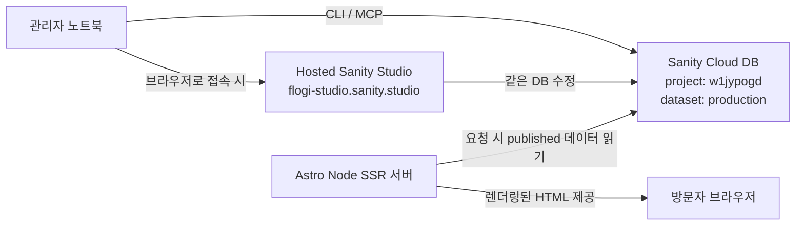

# Flogi's Blog

> Reference-inspired AI/media blog prototype built with Astro and Sanity.

Flogi's Blog는 스터디, 회의, 작업 기록을 정리하는 **Astro + Sanity 프로토타입**입니다.

## Features
- 홈, 스터디, 회의, 작업 목록/상세 페이지
- 모달형 검색 UX
- 런타임 RSS, sitemap
- Sanity 스키마 초안
- Sanity 미연결 시 fallback 샘플 데이터 지원
- TXT/오디오 회의 원본을 정리하고 검토 후 발행하는 Pi 에이전트

## Stack
- Astro 7
- `@astrojs/node` standalone SSR
- Tailwind CSS 4
- Sanity 6
- Marked (Markdown rendering)
- `@astrojs/rss`
- Self-hosted Node runtime

## Run locally
```bash
npm install
npm run dev
```

## Run Sanity Studio
```bash
cp .env.example .env
npm run studio
```

Hosted Studio:
- `https://flogi-studio.sanity.studio/`

현재 Sanity 프로젝트 기본값:
- `SANITY_PROJECT_ID=w1jypogd`
- `SANITY_DATASET=production`
- `SANITY_API_VERSION=2025-08-22`

필수 환경 변수는 `.env.example`를 참고하세요.

## Sanity MCP
- 이 프로젝트는 공식 hosted Sanity MCP `https://mcp.sanity.io` 사용을 기준으로 합니다.
- 로컬 CLI 에이전트에서 사용할 때는 `SANITY_API_TOKEN` 환경변수를 주입한 세션에서 bearer auth로 연결하세요.
- seed import는 MCP가 아니라 `docs/sanity-import.md`의 Sanity CLI 절차를 사용하세요.

## Build
```bash
npm run build
HOST=0.0.0.0 PORT=8080 node --env-file=.env dist/server/entry.mjs
```

공개 페이지는 요청 시점에 Sanity의 published 데이터를 SSR하므로 콘텐츠 발행 후 프론트엔드 재빌드가 필요하지 않습니다.

## Meeting source agent

```bash
npm run meeting:doctor
npm run meeting:prepare -- "/path/to/meeting.txt" --date 2026-08-25 --people person-id-1,person-id-2
```

오디오 원본에는 로컬 Whisper 모델이 필요합니다. preview 검토와 Sanity 발행 절차는 `docs/meeting-agent.md`를 따릅니다.

## Main routes
- `/`
- `/study`
- `/study/[slug]`
- `/meetings`
- `/meetings/[slug]`
- `/work`
- `/work/[slug]`
- `/search`
- `/tags`
- `/tags/[slug]`
- `/people`
- `/people/[slug]`
- `/rss.xml`

## Project structure
```txt
src/
  components/
    cards/
    content/
    layout/
  layouts/
  lib/
    cms/
    fallback/
    renderers/
    repositories/
    services/
    types/
    utils/
  pages/
    study/
    meetings/
    work/
```

## Sharing and operations
- Flogi 콘텐츠 운영은 **관리자 3명**이 담당합니다.
- 기본 포스팅 작업은 각자 **CLI**로 진행합니다.
- 화면을 보며 직접 수정해야 할 때만 Hosted Studio(`https://flogi-studio.sanity.studio/`)를 사용합니다.
- MCP/CLI 사용자는 각자 자신의 `SANITY_API_TOKEN`을 환경변수로 주입해 공식 Sanity MCP와 Sanity CLI를 사용합니다.
- 글을 작성하거나 다듬을 때는 가능한 한 에이전트가 `skills/flogi-thumbnail-prompt/SKILL.md`를 함께 사용해 **썸네일 훅 추출 → 프롬프트 생성 → 이미지 시안 생성**까지 이어서 처리하는 것을 권장합니다.

## Sanity operating model


- 작업의 출발점은 **관리자 노트북 1대**라고 보면 됩니다.
- 기본 작업은 **CLI / MCP / 로컬 CLI 에이전트**로 진행합니다.
- 직접 화면을 보며 수정할 때만 브라우저에서 **Hosted Sanity Studio**를 엽니다.
- CLI와 Studio는 모두 같은 **Sanity Cloud DB (`w1jypogd / production`)** 를 수정합니다.
- **프론트엔드 서버**는 방문자 요청 시 그 DB를 읽어 HTML을 렌더링합니다.

### Document ID convention
```text
siteSettings
person-<slug>
study-<slug>
meeting-<slug>
work-<slug>
```

## Admin setup shortcuts
### 1) Sanity API token 발급
- 프로젝트 API 관리 바로가기: `https://www.sanity.io/manage/project/w1jypogd/api`
- 위 페이지에서 각 관리자 계정으로 **개인용 token**을 발급하세요.
- 토큰은 GitHub, 채팅, `.env`에 평문으로 공유하지 마세요.

### 2) CLI 기본 확인
```bash
cd /Users/hskim/Projects/aifrontier-media
npx sanity debug
npx sanity documents query '*[_type == "study"]{_id,title,slug}'
```

### 3) 로컬 CLI 에이전트 + 공식 MCP 실행 예시
프로젝트 루트 `.mcp.json`은 이미 공식 hosted MCP를 사용하도록 설정되어 있습니다.

Bitwarden 주입 세션에서 로컬 CLI 에이전트 실행:
```bash
export BWS_ACCESS_TOKEN="$(security find-generic-password -w -s bitwarden-bws-access-token)"
bws run -- <your-local-cli-agent>
```

### 4) 로컬 CLI 에이전트에 붙여넣는 프롬프트 예시
현재 스터디 문서 확인:
```text
Use the official Sanity MCP tools only. Connect to project w1jypogd dataset production and list all study documents with _id, title, slug, and published status.
```

새 문서 작성 전 스키마 확인:
```text
Use the official Sanity MCP tools only. Inspect the schema for study, meeting, and work in project w1jypogd / production and summarize the required fields before creating any document.
```

특정 문서 수정:
```text
Use the official Sanity MCP tools only. In project w1jypogd dataset production, load document study-<slug>, show me its current fields, then prepare the exact patch needed to update title, slug, publishedAt, tags, and body.
```

## Notes
- 이 저장소는 프로토타입이지만, 데이터 정규화/empty state/SEO fallback/strict content mode까지 포함해 운영 연결 전 마감 작업을 진행한 상태입니다.
- 콘텐츠 fallback 목업 데이터는 제거되어, Sanity가 비어 있으면 목록/상세 대신 빈 상태 UI가 보입니다.
- 운영 배포에서는 `SANITY_STRICT_CONTENT=true` 설정을 권장합니다.
- 글 작성/수정은 프론트 서비스 내부가 아니라 `Sanity Studio`에서 수행합니다.
- 수정 권한은 앱 내부 권한 시스템이 아니라 `Sanity 프로젝트 멤버 권한`으로 관리합니다.
- 실제 `.env*` 파일이나 비밀값은 커밋하지 마세요.

## Codex용 썸네일 스킬
이 저장소에는 **Codex 사용자를 기준으로 만든** 공유용 썸네일 스킬이 포함되어 있습니다.

- 스킬 위치: `skills/flogi-thumbnail-prompt/SKILL.md`

이 스킬은 Codex 기반 로컬 에이전트가:
- 글 본문을 읽고,
- 썸네일에 넣을 핵심 훅을 1개 고르고,
- Flogi 스타일 규칙을 적용해,
- 바로 이미지 생성에 넣을 수 있는 프롬프트를 만들고,
- 필요하면 이미지 시안까지 생성하도록 돕습니다.

### 왜 이 스킬을 쓰는가
Flogi에서는 글마다 주제가 달라도 썸네일이 제각각 따로 노는 느낌이 나지 않게,
**색감 / 구도 / 정보 밀도 / 분위기**를 최대한 같은 시리즈처럼 맞추는 것을 중요하게 봅니다.

즉, 이 스킬의 목적은 단순히 이미지를 한 장 만드는 것이 아니라,
**Codex가 글을 읽는 단계부터 썸네일을 통일감 있게 만들도록 작업 규칙을 고정하는 것**입니다.

현재 `인프라 입문 정리: Unix에서 Linux, 그리고 VM·컨테이너까지` 글에는 아래 생성 이미지를 대표 이미지로 사용했습니다.

- 예시 이미지: `generated-images/image_1787712504559_1536-1024.png`

앞으로도 새 글을 작성할 때는 본문 작성만 끝내지 말고,
Codex가 이 스킬을 함께 사용해 **대표 훅 추출 → 프롬프트 생성 → 이미지 시안 생성**까지 이어서 진행하는 것을 권장합니다.

### 이미지 생성 모델
이 워크플로우에서 기본으로 염두에 둔 이미지 생성 모델은 **OpenAI `gpt-image-2`** 입니다.

즉, 흐름은 아래와 같습니다.
- Codex가 글을 읽고 스킬 규칙에 따라 썸네일 방향을 정함
- 스킬이 최종 프롬프트와 negative prompt를 만듦
- 이미지 생성은 `gpt-image-2` 같은 연결된 이미지 생성 모델로 수행함

### Codex에서 사용하는 방법
로컬 Codex 환경에서 skills를 읽을 수 있으면, 이 폴더를 그대로 복사하거나 symlink해서 사용할 수 있습니다.

예시:
```bash
mkdir -p ~/.codex/skills
ln -s /path/to/this-repo/skills/flogi-thumbnail-prompt ~/.codex/skills/flogi-thumbnail-prompt
```

그다음 Codex에게 글 초안이나 게시된 글을 읽히고, 이 스킬을 사용해 썸네일 프롬프트와 이미지 시안을 만들게 하면 됩니다.

### 다른 Codex 유저가 실제 이미지까지 생성하려면
아래 3가지가 있으면 됩니다.

1. **Codex가 skills를 읽을 수 있어야 함**
   - 위 예시처럼 `~/.codex/skills` 아래에 이 스킬을 연결합니다.

2. **이미지 생성 도구가 연결되어 있어야 함**
   - 이 워크플로우의 기본 기준 모델은 `gpt-image-2` 입니다.
   - 즉, Codex 환경에서 `gpt-image-2`를 호출할 수 있는 image generation tool 또는 wrapper가 있어야 합니다.

3. **Codex/OpenAI 인증이 되어 있어야 함**
   - 이미지 생성이 가능한 계정/세션이어야 실제 시안 생성까지 진행됩니다.

### 최소 사용 순서
1. 글 초안 또는 게시된 글 본문을 Codex가 읽게 합니다.
2. `flogi-thumbnail-prompt` 스킬을 사용해
   - thesis,
   - hook,
   - metaphor,
   - final prompt,
   - negative prompt
   를 먼저 뽑게 합니다.
3. 그다음 `gpt-image-2`로 2~3개 시안을 생성하게 합니다.
4. 시안 중에서 가장 썸네일성이 높은 것을 고릅니다.

### Codex에 바로 넣을 수 있는 예시 요청
```text
Read this article and use the flogi-thumbnail-prompt skill.
First extract the thesis, hook, metaphor, composition, final prompt, and negative prompt.
Then generate 3 thumbnail variants with gpt-image-2 in a calm, minimal, technical Flogi style.
Rank the 3 variants by thumbnail readability, not by detail richness.
```

### 호환성 메모
- 이 스킬은 Codex 사용자 워크플로우를 기준으로 작성했습니다.
- 다만 스킬 내용 자체는 문서형 규칙이므로 다른 로컬 CLI 에이전트에도 옮겨 쓸 수 있습니다.
- 프롬프트 생성은 범용적으로 사용할 수 있습니다.
- 실제 이미지 생성은 `gpt-image-2` 또는 그에 준하는 이미지 생성 기능이 연결되어 있을 때 가장 자연스럽게 동작합니다.

## Docs
- `docs/architecture.md`
- `docs/content-model.md`
- `docs/deployment.md`
- `docs/editorial-workflow.md`
- `docs/meeting-agent.md`
- `docs/handoff.md`
- `docs/thumbnail-agent-workflow.md`
- `infra/jenkins/README.md`
- `infra/k8s/README.md`
